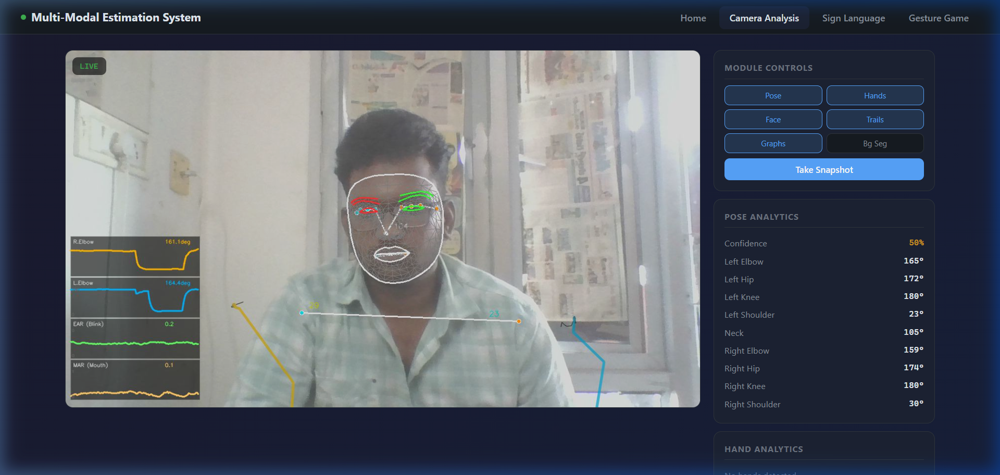
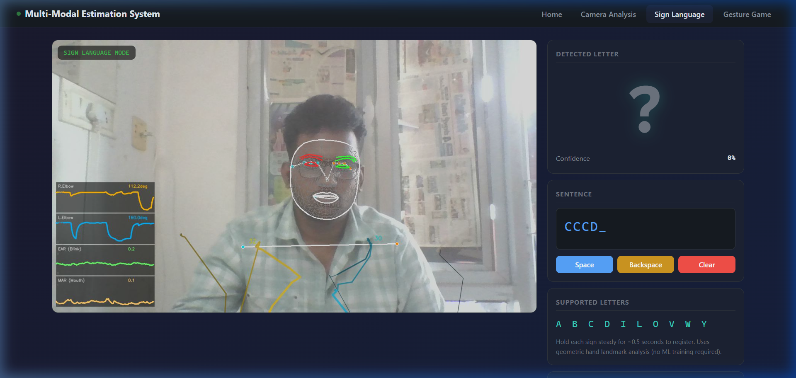
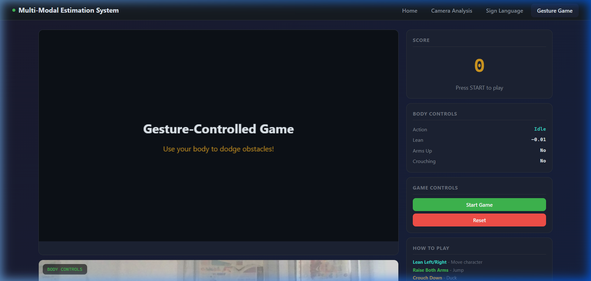

# Multi-Modal Human Pose & Gesture Estimation System

[](https://www.python.org/downloads/)
[](https://mediapipe.dev/)
[](https://flask.palletsprojects.com/)

An advanced real-time computer vision system that integrates body pose estimation, hand gesture recognition, facial expression analysis, sign language recognition, and activity tracking into a single, cohesive web dashboard.

##  Key Features

*   **Body Pose Analysis**: 33-landmark skeleton tracking with 9 real-time joint angles.
*   **Hand Gesture Recognition**: 12+ static gestures classified using geometric heuristics.
*   **ASL Sign Language**: Rule-based recognition for 20 alphabet letters (A-Y) with sentence building.
*   **Facial Expressions**: EAR (Eye Aspect Ratio) and MAR (Mouth Aspect Ratio) for blink, yawn, and talk detection.
*   **Exercise Tracking**: State-machine based rep counting for Squats, Bicep Curls, and Shoulder Presses.
*   **Symmetry Analysis**: Real-time bilateral joint symmetry scoring for posture correction.
*   **Gesture-Controlled Game**: An HTML5 Canvas dodging game controlled entirely by body lean, jumping, and ducking.
*   **Advanced DL Motion Prediction**: PyTorch LSTM-based sequence-to-sequence forecasting for future joint trajectories.
*   **Premium Visuals**: Neon-style skeleton rendering and real-time scrolling analytics graphs.

##  Tech Stack

*   **Core**: Python, OpenCV, MediaPipe
*   **Deep Learning**: PyTorch (LSTM models)
*   **Web Dashboard**: Flask, Vanilla HTML/CSS/JS (MJPEG streaming)
*   **Math**: NumPy, SciPy (EMA Filters)
*   **Reporting**: LaTeX

##  Dashboard Showcase

### Camera Analysis Page


### Sign Language Translation


### Gesture Controlled Game


##  Installation

1.  **Clone the Repository**
    ```bash
    git clone https://github.com/Niranjan7771/MM.git
    cd MM
    ```

2.  **Setup Virtual Environment**
    ```bash
    python -m venv venv
    # Windows:
    venv\Scripts\activate
    # Linux/macOS:
    source venv/bin/activate
    ```

3.  **Install Dependencies**
    ```bash
    pip install -r requirements.txt
    ```

##  Usage

### 1. Web Dashboard (Recommended)
Launch the interactive browser interface:
```bash
python app.py
```
Open **`http://localhost:5000`** in your browser.

### 2. Standalone OpenCV Mode
Run the high-performance local viewer with keyboard shortcuts:
```bash
python main.py
```
*   **P**: Toggle Pose | **H**: Toggle Hands | **F**: Toggle Face
*   **T**: Toggle Trails | **G**: Toggle Graphs | **B**: Background Seg
*   **S**: Snapshot | **R**: Rec CSV | **V**: Rec Video | **Q**: Quit

##  Project Structure

*   `app.py`: Flask entry point.
*   `src/core/`: Heavy lifting analysis engines (pose, hands, face, etc.).
*   `src/utils/`: Math utilities, smoothing filters, and HUD renderers.
*   `src/web/`: Stream management and API routes.
*   `templates/` & `static/`: Frontend dashboard assets.
*   `report/`: LaTeX project documentation.
*   `models/`: Pre-trained PyTorch weights.

